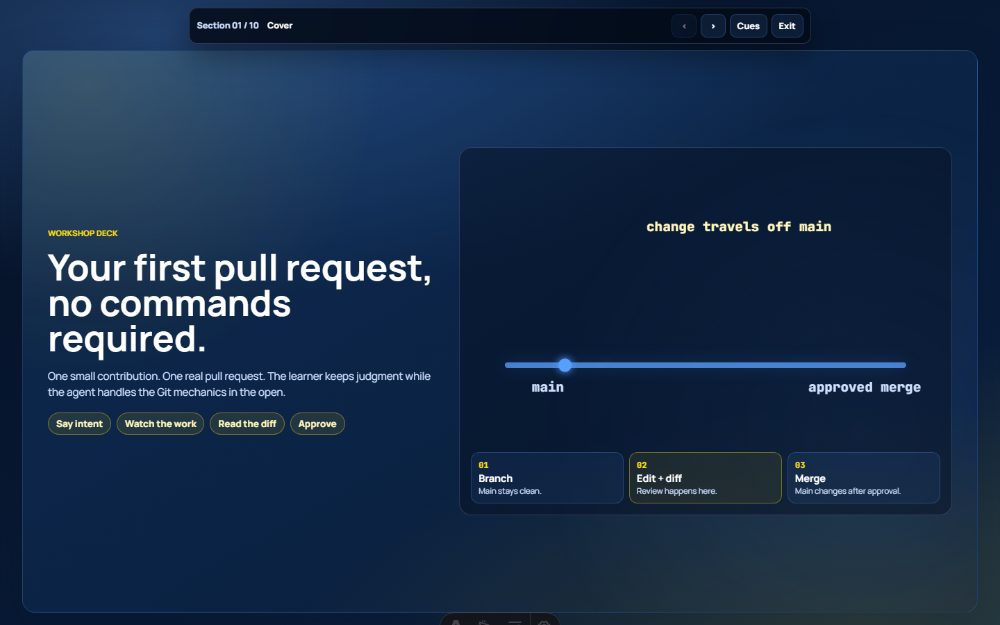

# Article Visuals Skill

A copyable skill for helping an AI coding agent turn text-heavy articles into visual explanations people can learn from.

Use it when an article would be easier to understand with a visual aid, animated component, or optional browser-native present mode.

## What It Does

| Job | Outcome |
|---|---|
| Scan an article | Finds where readers need visual help and ranks possible visual aids. |
| Brief a visual | Defines the teaching job, labels, motion, viewports, and screenshot checks. |
| Plan present mode | Decides whether the article can become a talk and what slides should exist. |
| Review rendered output | Checks whether the article, visual, motion, and present route work in the browser. |

## Copy Path

This package lives here:

```text
skills/content/article-visuals/
```

To use it in a VS Code repo, copy the skill file, prompts, and optional README into:

```text
.github/skills/article-visuals/SKILL.md
.github/skills/article-visuals/prompts/
```

If your agent system uses a different skill location, keep the same folder contents and adapt the path.

## First Prompt

```text
Use the article visuals skill.
Read this article and identify the best visual opportunities.
Rank the top five visual aids, explain the teaching job for each, and recommend the smallest first HTML component to build.
```

## Proof

The working reference is Thor Draper Jr's blog:

- Article with visuals: <https://thordraperjr.com/tech/first-pull-request/>
- Present mode: <https://thordraperjr.com/tech/first-pull-request/present/>



## Why It Is Useful

Text can explain an idea, but some ideas land faster when a reader can see sequence, state, flow, contrast, or scale. This skill gives the agent a focused job: find those moments, propose useful visuals, build the smallest helpful component, and check it in the browser.

## Verified Scope

This skill is verified against Thor Draper Jr's Astro blog. Other stacks can use the same judgment, but they should adapt to their own article, component, route, and validation patterns.
